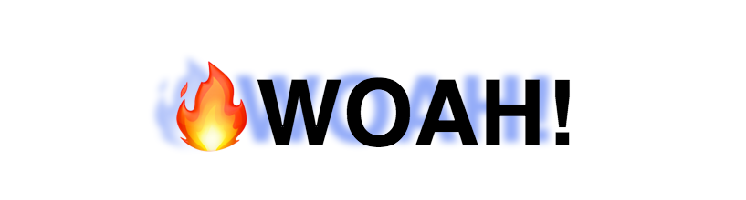

# _Mousemove Shadow Effect_

#### _using the x/y values to make a moving text shadow effect_

#### By _**Kyle Lange**_

## Learnings

* use the x/y values of a mousemove event

* use some math with the offsetWidth and offsetHeight to center the travel of the shadow to the element

## Setup/Installation Requirements

1. Download this repo using your terminal: git clone repo-name pasted here

2. View the code by drag-and-dropping the file into your [favorite text editor](https://atom.io)

3. run/check-out the program by dropping the index/html file from your folder into your web browser

## Known Bugs

_There are no known bugs as of the last commit. Please send an ISSUE on github in the repository if you see something I have not._

## Technologies Used

* HTML5
* CSS3
* Vanilla JavaScript

### License

Copyright (c) 2016 **_Kyle Lange_**

This program is free software: you can redistribute it and/or modify
    it under the terms of the GNU General Public License as published by
    the Free Software Foundation, either version 3 of the License, or
    (at your option) any later version.

    This program is distributed in the hope that it will be useful,
    but WITHOUT ANY WARRANTY; without even the implied warranty of
    MERCHANTABILITY or FITNESS FOR A PARTICULAR PURPOSE.  See the
    GNU General Public License for more details.

    You should have received a copy of the GNU General Public License
    along with this program.  If not, see <http://www.gnu.org/licenses/>.
